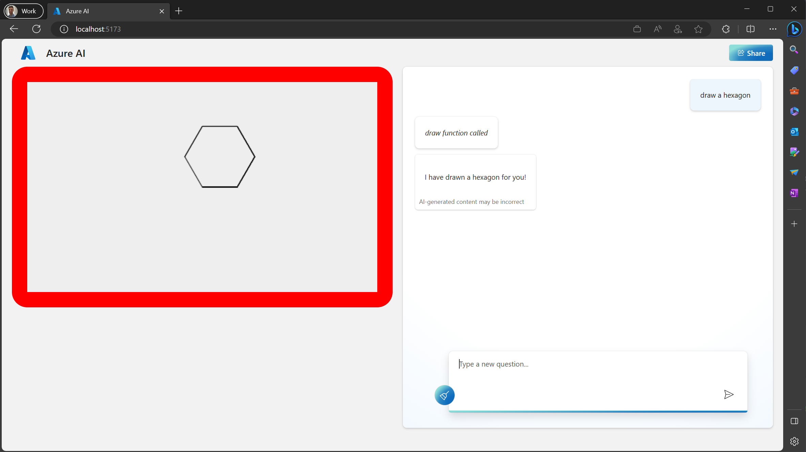

# Etch-a-Sketch Copilot Demo



## Motivation

A very simple demo of how to use Copilot to generate code for a simple Etch-a-Sketch game.

A 'draw' function is registered with the OpenAI API. The user types in commands like `draw a circle`, `draw a triangle`, and the API responds with an instruction to call the draw function, and the array of movements required by the pen to draw the shape.

The shapes coordinates are generated by the AI. When using ChatGPT 3.5 Turbo it's able to draw simple geometric shapes like circles, triangles, squares, and rectangles (with some degree of variation).

The main aim is to demonstrate the 'functions' feature of the OpenAI API, as a convenient way for applications to trigger actions based on user input, in addition to the text responses.

## Installation

1. Install npm

```bash
$ cd backend
$ npm i
$ cd ../frontend
$ npm i
```
2. Create a .env file in the backend folder with the following contents:

```
OPEN_AI_ENDPOINT=https://XXX.openai.azure.com/openai/deployments/XXX/chat/completions?api-version=2023-07-01-preview
OPEN_AI_KEY=XXX
```

## Run Locally

1. Start the backend server

```bash
$ cd backend
$ npm run dev
```

2. Start the frontend server

```bash
$ cd frontend
$ npm run dev
```

3. Open [http://localhost:5173/](http://localhost:5173/) in your browser

4. Type in commands like `draw a circle`, `draw a triangle`.

## License

MIT